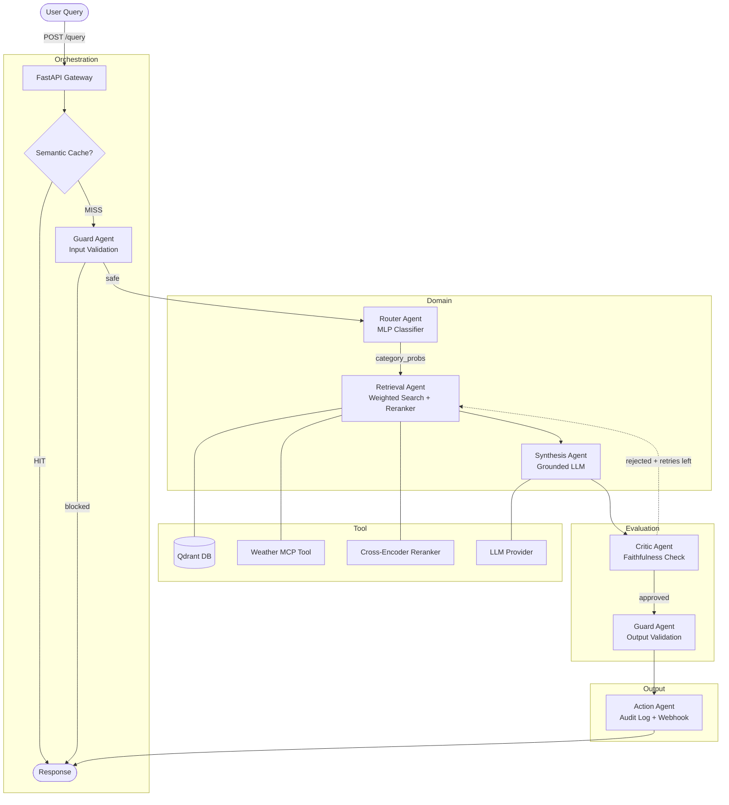

# Knowledge Assistant

A multi-agent Agentic RAG system for the sustainable energy and smart building knowledge domain. The system routes natural-language queries through a seven-agent LangGraph pipeline — classifier, retriever-ranker, synthesiser, faithfulness critic, security guard, session cache, and automated action — and exposes a FastAPI REST interface.

## Architecture



## Core Features

- **MLP Router**: A PyTorch MLP trained on the document corpus classifies every query into three knowledge domains (Science, Software, User) using `all-MiniLM-L6-v2` sentence embeddings. Produces a probability distribution, not a hard label.
- **Two-Stage Retriever-Ranker**: Weighted Qdrant vector search (`Score = P(c|q) × sim(q,d)`) followed by `cross-encoder/ms-marco-MiniLM-L6-v2` reranking. Retrieves 10 candidates, reranks, returns top 5.
- **Critic Feedback Loop**: After synthesis the Critic Agent evaluates faithfulness via an LLM call. A rejected response triggers re-retrieval with a refined query. This is the system's dynamic inter-agent communication mechanism (up to `max_retries=2` loops before force-approval).
- **Guard Agent**: Validates input (length limit, regex injection patterns) before the pipeline runs, and validates output (leak markers) before delivery. Fail-closed on input; fail-open on critic failure.
- **Semantic Cache**: Qdrant-backed query cache. Queries with cosine similarity ≥ 0.95 to a cached entry return the stored response without invoking any agents (1-hour TTL).
- **Multi-Provider ModelRegistry**: Checks API keys in priority order — Gemini → Claude → Groq → OpenRouter → Kimi → Ollama — and prints the active provider at startup. All providers implement the same `BaseChatModel` interface; switching providers requires only an environment variable change.
- **Environmental Context Injection**: When the Science domain probability exceeds 0.4, the Retrieval Agent invokes a configurable MCP tool that injects environmental metadata (temperature, humidity, precipitation) into the synthesis context.
- **Automated Action**: Every completed request is appended to `logs/audit.jsonl`. An optional webhook POST fires if `WEBHOOK_URL` is configured.
- **FastAPI Interface**: `POST /query`, `GET /health`, `GET /metrics` endpoints with Pydantic request/response validation and a 30-second timeout guard.

## Stack

| Component | Technology |
|-----------|-----------|
| Orchestration | LangGraph `StateGraph` with conditional edges and retry loop |
| Vector database | Qdrant (Docker) |
| Router embeddings | `sentence-transformers/all-MiniLM-L6-v2` |
| Retrieval embeddings | `BAAI/bge-large-en-v1.5` |
| Reranker | `cross-encoder/ms-marco-MiniLM-L6-v2` |
| LLM (primary) | Google Gemini 2.0 Flash Lite / Flash |
| LLM (alternatives) | Claude Haiku, Groq Llama 3.3 70B, OpenRouter, Kimi K2.5, Ollama phi3:mini |
| API framework | FastAPI + uvicorn |
| ML framework | PyTorch 2.2.2, sentence-transformers, LangChain |
| Evaluation | Ragas (faithfulness, context_recall), ROUGE-L, semantic similarity |
| Configuration | Pydantic `BaseSettings` |
| Runtime | Python 3.11+, Poetry |

## Project Structure

```text
.
├── src/
│   ├── agents/
│   │   ├── action_agent.py      # Audit log + optional webhook
│   │   ├── critic_agent.py      # Faithfulness evaluator — drives retry loop
│   │   ├── guard_agent.py       # Input validation + output safety check
│   │   ├── graph.py             # LangGraph StateGraph — 8-node topology
│   │   ├── retrieval_agent.py   # Weighted search + MCP enrichment
│   │   ├── router_agent.py      # MLP domain classifier
│   │   ├── state.py             # GraphState TypedDict (20 fields)
│   │   └── synthesis_agent.py   # Grounded LLM response generation
│   ├── api/
│   │   ├── main.py              # FastAPI app (POST /query, GET /health, GET /metrics)
│   │   └── schemas.py           # Pydantic request/response models
│   ├── cache/
│   │   └── semantic_cache.py    # Qdrant-backed query cache
│   ├── config/
│   │   ├── model_registry.py    # Multi-provider LLM abstraction
│   │   └── settings.py          # Pydantic BaseSettings — all configuration
│   ├── evaluation/
│   │   ├── eval_runner.py       # Full evaluation pipeline
│   │   ├── metrics.py           # timing_decorator, ROUGE-L, semantic similarity
│   │   └── tracer.py            # Per-agent JSONL tracer
│   ├── memory/
│   │   └── session_store.py     # In-memory session history with TTL
│   ├── retrieval/
│   │   └── weighted_retriever.py # Qdrant search + cross-encoder reranking
│   ├── router/
│   │   └── mlp_router.py        # PyTorch MLP + sentence-transformer embedder
│   └── tools/
│       └── weather_mcp.py       # Mock environmental data MCP tool
├── data/
│   ├── eval/
│   │   └── test_suite.json      # 20-question evaluation dataset
│   ├── scientific/              # 13 PV physics and building thermodynamics files
│   ├── software/                # 15 HEMS, EV charger, thermostat API files
│   └── user/                    # 7 safety manuals and scheduling guides
├── tests/
│   ├── test_action.py           # ActionAgent (3 tests)
│   ├── test_api.py              # FastAPI endpoints (4 tests)
│   ├── test_critic.py           # CriticAgent (3 tests)
│   ├── test_guard.py            # GuardAgent (6 tests)
│   ├── test_integration.py      # End-to-end graph (3 tests)
│   ├── test_model_registry.py   # Provider detection (4 tests)
│   ├── test_router.py           # MLPRouter (6 tests)
│   └── test_synthesis.py        # SynthesisAgent (3 tests)
├── scripts/
│   ├── download_local_model.py  # Ollama setup helper
│   └── run_evaluation.py        # Evaluation CLI wrapper
├── logs/                        # Runtime logs (gitignored)
├── reports/                     # Evaluation output (gitignored)
├── models/                      # Trained MLP weights (gitignored)
├── chat.py                      # Interactive CLI interface
├── setup.py                     # Bootstrap: MLP training + Qdrant indexing
├── smoke_test.py                # Legacy two-query smoke test
├── run.sh                       # All-in-one setup and launch script
├── Dockerfile                   # Multi-stage CPU-only build (~1.5 GB)
├── docker-compose.yml           # Qdrant + API services
├── .env.example                 # Environment variable template
└── pyproject.toml               # Poetry dependencies + dev tools
```

## Setup & Installation

### Prerequisites

- Python 3.11 or 3.12
- [Poetry](https://python-poetry.org/docs/) — dependency management
- [Docker](https://docs.docker.com/get-docker/) — runs Qdrant vector database

### 1. Install dependencies

```bash
git clone <repo-url>
cd multi-domain-assistant
poetry install
```

To install optional LLM provider packages alongside the core dependencies:

```bash
# Install one provider: gemini, claude, groq, openrouter, kimi, ollama
poetry install --extras groq

# Install all providers at once
poetry install --extras all-providers
```

### 2. Configure the environment

```bash
cp .env.example .env
```

Open `.env` and set at least one of the following API keys. The system checks them in priority order and selects the first available provider automatically.

```bash
# Option 1 — Google Gemini (free tier available, primary default)
GOOGLE_API_KEY=your_key_here

# Option 2 — Anthropic Claude (paid, $5 minimum deposit)
ANTHROPIC_API_KEY=your_key_here

# Option 3 — Groq (genuinely free ongoing tier, no credit card)
GROQ_API_KEY=your_key_here

# Option 4 — OpenRouter (free :free models available)
OPENROUTER_API_KEY=your_key_here

# Option 5 — Moonshot / Kimi (verify regional access first)
MOONSHOT_API_KEY=your_key_here

# Option 6 — Ollama local inference (no API key needed)
# Install Ollama: https://ollama.ai/download
# Then: ollama pull phi3:mini
LLM_PROVIDER=ollama
```

To force a specific provider regardless of which keys are present:

```bash
LLM_PROVIDER=groq   # valid values: gemini | claude | groq | openrouter | kimi | ollama
```

The active provider is always printed to stdout at startup:

```
[ModelRegistry] Active provider: Groq (llama-3.1-8b-instant / llama-3.3-70b-versatile)
```

### 3a. Quick Start — Automatic (`run.sh`)

The script checks prerequisites, starts Qdrant, indexes documents, trains the MLP router, runs the test suite, starts the FastAPI server, and prints a usage summary.

```bash
chmod +x run.sh
./run.sh
```

### 3b. Quick Start — Docker Compose

Runs both Qdrant and the API application in containers. Documents must be indexed separately because the corpus is mounted as a volume.

```bash
# Start Qdrant + API containers
docker-compose up --build

# In a separate terminal: train MLP and index documents into the containerised Qdrant
QDRANT_URL=http://localhost:6333 poetry run python setup.py
```

### 4. Manual Execution

#### A. Start Qdrant

```bash
docker run -d -p 6333:6333 --name qdrant_rag qdrant/qdrant
```

#### B. Index documents and train the MLP router

```bash
poetry run python setup.py
```

This reads all files from `data/scientific/`, `data/software/`, and `data/user/`, splits them into 512-character overlapping chunks, trains the MLP classifier for 50 epochs, and indexes the chunks into Qdrant. Expected runtime: 3–8 minutes depending on hardware.

#### C. Start the API server

```bash
poetry run uvicorn src.api.main:app --host 0.0.0.0 --port 8000 --reload
```

#### D. Interactive CLI

```bash
poetry run python chat.py
```

## API Reference

### `POST /query`

Submit a natural-language query and receive a grounded response.

**Request body:**

```json
{
  "query": "What are the NFPA 855 clearance requirements for BESS?",
  "session_id": "optional-session-id",
  "is_help_override": false
}
```

| Field | Type | Required | Description |
|-------|------|----------|-------------|
| `query` | string | Yes | Query text (1–2000 characters) |
| `session_id` | string | No | Reuse to maintain conversation history across turns |
| `is_help_override` | bool | No | Forces Software 85% / Science 15% domain weighting |

**Response body:**

```json
{
  "response": "A minimum 3-foot (36-inch) clearance from combustibles must be maintained.",
  "sources_cited": ["bess_safety_nfpa855.txt"],
  "category_probs": {"Science": 0.08, "Software": 0.15, "User": 0.77},
  "dominant_category": "User",
  "confidence": 0.77,
  "retrieval_time_ms": 142.3,
  "token_count": 310,
  "retry_count": 0,
  "from_cache": false
}
```

**Example:**

```bash
curl -s -X POST http://localhost:8000/query \
  -H "Content-Type: application/json" \
  -d '{"query": "What are the NFPA 855 clearance requirements for BESS?"}' \
  | python3 -m json.tool
```

### `GET /health`

Returns Qdrant connectivity status and active LLM provider.

```bash
curl http://localhost:8000/health
```

```json
{
  "status": "ok",
  "qdrant_connected": true,
  "active_provider": "groq"
}
```

`status` is `"ok"` when Qdrant is reachable, `"degraded"` otherwise. The API continues to serve cached responses when degraded.

### `GET /metrics`

Returns aggregated request metrics since the last process start.

```bash
curl http://localhost:8000/metrics
```

```json
{
  "total_requests": 24,
  "avg_latency_ms": 1843.5,
  "error_rate": 0.0,
  "cache_hit_rate": 0.125,
  "total_errors": 0,
  "total_cache_hits": 3
}
```

Interactive API documentation is available at `http://localhost:8000/docs` (Swagger UI) while the server is running.

## Evaluation

The evaluation suite runs 20 test questions across all three knowledge domains and computes eight metrics per question.

```bash
# Default: loads data/eval/test_suite.json, writes reports/evaluation_results.json
poetry run python scripts/run_evaluation.py

# Custom paths
poetry run python scripts/run_evaluation.py \
  --questions data/eval/test_suite.json \
  --output reports/my_run.json
```

Requires `GOOGLE_API_KEY` in `.env` for the Ragas LLM-based metrics (faithfulness, context_recall). All other metrics are computed locally.

**Metrics computed:**

| Metric | Method | Description |
|--------|--------|-------------|
| `faithfulness` | Ragas (LLM) | Fraction of response claims supported by retrieved context |
| `context_recall` | Ragas (LLM) | Fraction of ground-truth statements retrievable from context |
| `precision_at_k` | Chunk category match | Fraction of top-5 chunks from the expected domain |
| `retrieval_time_ms` | Timer | Qdrant search + reranking latency |
| `total_latency_ms` | Timer | Full pipeline latency per question |
| `token_count` | LLM metadata | Total tokens consumed by the LLM |
| `semantic_similarity` | `bge-large-en-v1.5` cosine | Cosine similarity between generated and reference answer |
| `rouge_l` | `rouge-score` | ROUGE-L F1 between generated and reference answer |

## Testing

```bash
# Run all 32 tests
poetry run pytest tests/ -v

# Run only fast unit tests (no external dependencies)
poetry run pytest tests/ -v \
  --ignore=tests/test_api.py \
  --ignore=tests/test_integration.py
```

| Test file | Coverage | Tests |
|-----------|----------|-------|
| `test_router.py` | `MLPRouter.route()` — structure, probabilities, edge cases | 6 |
| `test_guard.py` | `GuardAgent` — safe inputs, rejections, injection detection | 6 |
| `test_synthesis.py` | `SynthesisAgent` — mocked LLM, source extraction, fallback | 3 |
| `test_critic.py` | `CriticAgent` — approval, rejection, LLM failure fallback | 3 |
| `test_action.py` | `ActionAgent` — log write, webhook failure handling | 3 |
| `test_model_registry.py` | Provider detection priority, forced provider override | 4 |
| `test_api.py` | FastAPI endpoints — schema validation, health, metrics | 4 |
| `test_integration.py` | Full graph pipeline — domain routing, overrides | 3 |

## Optional Provider Installation

The five alternative LLM providers are installed as Poetry extras to avoid bloating the default environment.

```bash
# Groq — free ongoing tier, best free option for Argentina
poetry install --extras groq
# Then set: GROQ_API_KEY=your_key_here

# Anthropic Claude — paid, $5 minimum deposit
poetry install --extras anthropic
# Then set: ANTHROPIC_API_KEY=your_key_here

# OpenRouter — free :free models
poetry install --extras openrouter
# Then set: OPENROUTER_API_KEY=your_key_here

# Moonshot / Kimi — verify regional access
poetry install --extras moonshot
# Then set: MOONSHOT_API_KEY=your_key_here

# Ollama — local inference, no API key
poetry install --extras ollama
python scripts/download_local_model.py   # prints setup instructions
# Then set: LLM_PROVIDER=ollama

# All providers at once
poetry install --extras all-providers
```

## Configuration Reference

All settings are read from environment variables (or `.env`). The table below lists the most commonly adjusted values.

| Variable | Default | Description |
|----------|---------|-------------|
| `LLM_PROVIDER` | `auto` | Provider selection: `auto` \| `gemini` \| `claude` \| `groq` \| `openrouter` \| `kimi` \| `ollama` |
| `GOOGLE_API_KEY` | — | Google Gemini API key |
| `GROQ_API_KEY` | — | Groq API key |
| `QDRANT_URL` | `http://localhost:6333` | Qdrant server URL |
| `COLLECTION_NAME` | `rag_collection` | Qdrant collection for documents |
| `CACHE_SIMILARITY_THRESHOLD` | `0.95` | Cosine threshold for semantic cache hits |
| `CACHE_TTL_SECONDS` | `3600` | Cache entry expiry in seconds |
| `MAX_RETRIES` | `2` | Maximum critic-triggered re-retrieval loops |
| `ROUTER_CONFIDENCE_THRESHOLD` | `0.8` | Above this value: use simple (faster) LLM tier |
| `RETRIEVAL_TOP_K` | `10` | Candidates fetched from Qdrant before reranking |
| `RETRIEVAL_FINAL_K` | `5` | Chunks passed to synthesis after reranking |
| `SCIENCE_THRESHOLD` | `0.4` | P(Science) above which MCP tool is invoked |
| `CHUNK_SIZE` | `512` | Document chunk size in characters |
| `CHUNK_OVERLAP` | `50` | Overlap between adjacent chunks |
| `SESSION_TTL_MINUTES` | `30` | Inactivity timeout for session history |
| `AUDIT_LOG_PATH` | `logs/audit.jsonl` | Path for the JSON audit log |
| `WEBHOOK_URL` | — | Optional webhook URL for automated action |
| `ENABLE_TRACING` | `false` | Write per-agent traces to `logs/agent_traces.jsonl` |
| `LANGCHAIN_API_KEY` | — | LangSmith API key for LangChain tracing |
