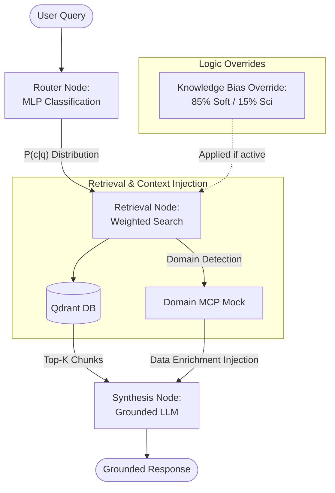

# Knowledge Assistant

## **Agentic RAG Assistant for Universal Knowledge Domains**

**Knowledge Assistant** is a local iteration of a multi-category document-consultation chatbot using an Agentic RAG architecture. By leveraging a custom MLP-based semantic router and weighted hybrid retrieval, this system can seamlessly navigate and synthesize information across disparate domains—from software documentation to scientific research.

## System Architecture



## Core Features

- **Semantic MLP Router**: A PyTorch-based Multi-Layer Perceptron that classifies user queries into distinct knowledge categories. The router is **locally trained** during the setup process using the provided document corpus to ensure accurate domain routing.
- **Weighted Retrieval Engine**: Implements a custom scoring formula: $Score(d) = P(c|q) * sim(q, d)$ to ensure retrieved documents are aligned with the routed category probabilities.
- **LangGraph Orchestration**: Managed StateGraph for seamless transition between Routing, Retrieval, and Synthesis nodes.
- **Interactive CLI**: Dedicated chat interface (`chat.py`) for real-time interaction with the Knowledge Assistant.
- **Cross-Domain Bias**: Configurable overrides (e.g., "Help" section bias) to prioritize specific knowledge bases when contextually appropriate.
- **Mock MCP Integration**: A domain-aware tool that fetches auxiliary metadata (like environmental data for Science queries) to enrich the synthesis context.
- **Truth-Maintenance Synthesis**: A grounded generation node that strictly adheres to retrieved context to prevent hallucinations.

## Stack

- **Orchestration**: LangGraph
- **Vector Database**: Qdrant (Local Docker)
- **Embeddings**:
  - Router: all-MiniLM-L6-v2
  - RAG Index: bge-large-en-v1.5
- **LLM**: Gemini Flash Lite (`gemini-flash-lite-latest`) or Claude.
- **Frameworks**: PyTorch, Sentence-Transformers, LangChain
- **Environment**: Python 3.11 (Poetry)
- **Evaluation**: Ragas

## Project Structure

```text
.
├── src/
│   ├── agents/
│   │   ├── graph.py        # LangGraph StateGraph definition
│   │   └── state.py        # Typed state management
│   ├── retrieval/
│   │   └── weighted_retriever.py # Qdrant weighted search logic
│   ├── router/
│   │   └── mlp_router.py   # PyTorch MLP inference class
│   └── tools/
│       └── weather_mcp.py  # Mock Science MCP tool
├── data/                   # Source documents (Software, User, Science)
├── models/                 # Serialized PyTorch models
├── chat.py                 # Interactive CLI chat interface
├── smoke_test.py           # Automated smoke test suite
├── run.sh                  # All-in-one setup and execution script
├── setup.py                # System bootstrap: Training & Indexing
├── evaluate.py             # Ragas evaluation script
├── list_models.py          # Utility to list available Gemini models
├── .env.example            # Environment variables template
└── pyproject.toml          # Dependency management
```

## Setup & Installation

### 1. Prerequisites

- Docker (for Qdrant)
- Poetry

### 2. Configure Environment

Copy the example environment file and add your API key:

```bash
cp .env.example .env
# Edit .env and add your GOOGLE_API_KEY
```

### 3. Quick Start (Automatic)

The provided `run.sh` script handles Docker initialization, indexing, and running tests:

```bash
chmod +x run.sh
./run.sh
```

### 4. Manual Execution

If you prefer to run steps individually:

**A. Initialize System & Index Documents**
The `setup.py` script trains the local MLP model on the available document corpus and indexes the files (supporting `.txt`, `.json`, `.yaml`, and `.py`) into Qdrant:

```bash
poetry run python setup.py
```

**B. Run Automated Smoke Test**
The `smoke_test.py` script executes a series of benchmark queries to verify routing logic and retrieval accuracy:

```bash
poetry run python smoke_test.py
```

**C. Interactive Chat**
To use the interactive CLI:

```bash
poetry run python chat.py
```

## Evaluation

The `evaluate.py` script utilizes the Ragas framework to measure system performance. It executes a strictly sequential evaluation to respect rate limits:

```bash
poetry run python evaluate.py
```

Key Metrics:

- **Faithfulness**: Ensures the synthesis node doesn't hallucinate technical steps.
- **Context Recall**: Verifies if the MLP Router is selecting the correct sources.

## Guardrails

- **Help Section Override**: Automatically redirects weights to 85% Software / 15% Science when `is_help_section` is active.
- **Groundedness Check**: The synthesis agent is instructed to report ignorance if the context is insufficient.
  ient.
