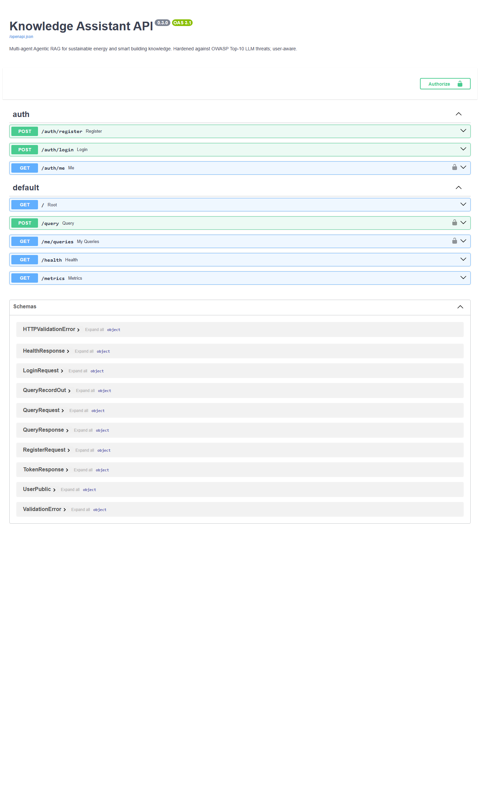
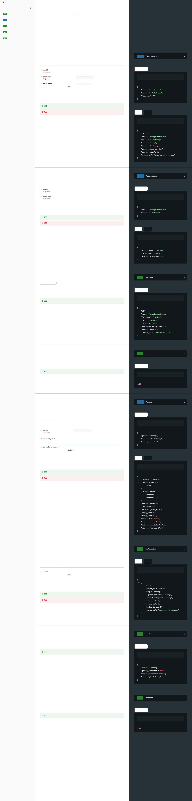
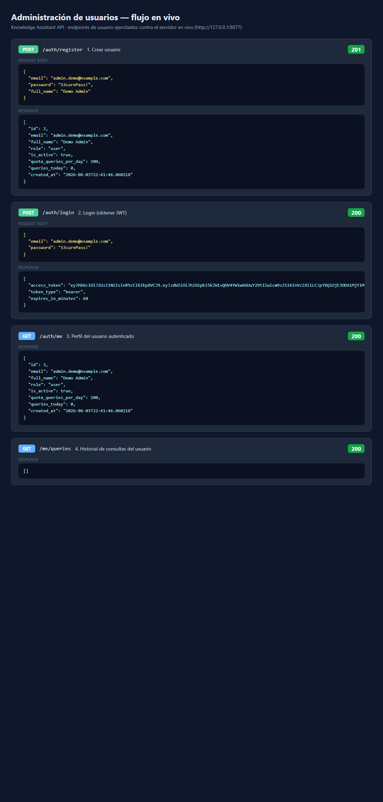

# Architecture: Domain / Service Layer Separation

> Resolves issue #4 — *Implement domain/service layer for architectural separation.*

## Screenshots

API surface and a live run of the user-management endpoints through the
refactored layer (captured against a running instance):

| | |
|---|---|
| Swagger UI (`/docs`) |  |
| ReDoc (`/redoc`)     |  |
| User admin flow (register → login → me → history) |  |

## Motivation

The FastAPI `/query` handler in `src/api/main.py` previously mixed three
concerns in a single 130-line function:

1. **Transport** — parsing the request, returning JSON, mapping errors to HTTP
   status codes.
2. **Business logic** — rate limiting, daily-quota enforcement, building the
   RAG pipeline inputs, the 30s timeout policy, metrics aggregation and
   experiment tracking.
3. **Persistence** — writing `QueryRecord` rows and incrementing the user's
   daily counter directly via SQLAlchemy.

Mixing these makes the business rules impossible to unit-test without spinning
up the web stack, and couples the rules to FastAPI and SQLAlchemy.

## The pattern: Ports & Adapters (Hexagonal)

Business logic now lives in `src/domain/`, depending only on **ports**
(abstract interfaces). Infrastructure implements those ports as **adapters**.
The dependency rule points inward — the domain never imports FastAPI or
SQLAlchemy.

```
            ┌──────────────────────── API adapter (src/api/main.py) ───────────────────────┐
            │  HTTP ⇄ domain translation only:                                              │
            │   • QueryRequest      → QueryCommand                                           │
            │   • QueryOutcome      → QueryResponse                                          │
            │   • DomainError       → HTTPException (429 / 504 / 500)                        │
            └───────────────────────────────────┬───────────────────────────────────────────┘
                                                │ calls
                                                ▼
            ┌──────────────────────── Application service (src/domain/services.py) ─────────┐
            │  QueryService.handle(command, quota_remaining_ok, repository)                  │
            │   1. rate limit   2. quota   3. RAG invoke (+timeout)                          │
            │   4. metrics      5. tracking 6. persist                                       │
            │  Depends ONLY on the ports below ──────────────┐                               │
            └───────────────────────────────────────────────┼───────────────────────────────┘
                                                            │ depends on (Protocols)
                          ┌───────────────┬─────────────────┼──────────────────┬─────────────┐
                          ▼               ▼                 ▼                  ▼             ▼
                     RateLimiter      RagEngine       ExperimentTracker   QueryRepository  MetricsCollector
                          ▲               ▲                 ▲                  ▲
                          │               │                 │                  │  (adapters implement ports)
                  SlidingWindowLimiter RagGraphEngine   MLflowManager    SqlAlchemyQueryRepository
                  (src/security)     (wraps RAGGraph)  (src/config)      (wraps SQLAlchemy Session)
```

## Package layout (`src/domain/`)

| Module          | Responsibility                                                                 |
|-----------------|--------------------------------------------------------------------------------|
| `models.py`     | `QueryCommand` / `QueryOutcome` — framework-agnostic dataclasses (the contract)|
| `exceptions.py` | Domain errors: `RateLimitExceededError`, `QuotaExceededError`, `QueryTimeoutError`, `QueryProcessingError` |
| `ports.py`      | `Protocol` interfaces: `RateLimiter`, `RagEngine`, `ExperimentTracker`, `QueryRepository` |
| `metrics.py`    | `MetricsCollector` (was an inline `_metrics` dict in the API)                   |
| `services.py`   | `QueryService` — orchestrates the query use case against the ports             |
| `adapters.py`   | `RagGraphEngine`, `SqlAlchemyQueryRepository` — concrete infra implementations |

## Request flow

1. `POST /query` builds a `QueryCommand` from the validated `QueryRequest` and
   passes `quota_remaining_ok` (derived from the live `User` row) plus a
   per-request `SqlAlchemyQueryRepository`.
2. `QueryService.handle` enforces rate limit → quota → runs the RAG pipeline in
   a worker thread with a 30s budget → records metrics, MLflow run, and
   persists the record via the repository → returns a `QueryOutcome`.
3. The API maps the `QueryOutcome` to a `QueryResponse`, or maps any
   `DomainError` to the matching HTTP status (429 / 504 / 500).

## Why `Protocol` and not ABCs

Existing classes (`SlidingWindowLimiter`, `MLflowManager`) already match the
port signatures structurally, so they satisfy the `Protocol`s without any
inheritance or edits. This keeps the refactor non-invasive while still
inverting the dependency.

## Extending

- **Swap persistence** (e.g. Postgres, or a write-behind queue): implement
  `QueryRepository` and inject it — the service is untouched.
- **Swap observability** (e.g. OpenTelemetry instead of MLflow): implement
  `ExperimentTracker`.
- **Add a new use case** (e.g. batch query, streaming): add a method/service in
  `src/domain/` that reuses the same ports; the API adds a thin route.
- **Unit-test business rules**: construct `QueryService` with fakes for each
  port — no FastAPI `TestClient`, no database, no MLflow server required.
