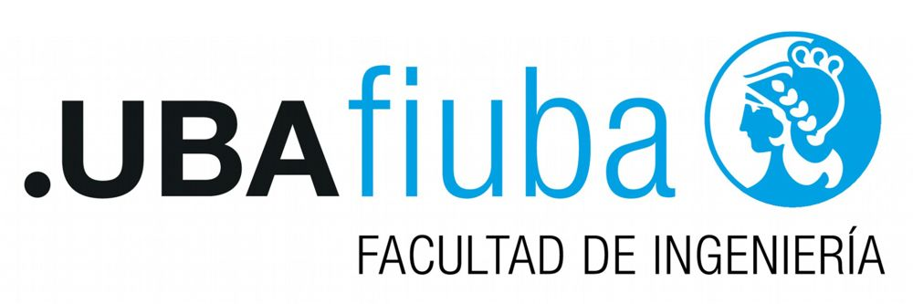

# Knowledge Assistant — Sistema multi-agente Agentic RAG seguro y alineado
## Procesamiento del Lenguaje Natural III _(NLP3)_
### Carrera de Maestría en Inteligencia Artificial (UBA) - _Cohorte 2_

Este repositorio contiene el informe del proyecto final desarrollado para la materia ***Procesamiento del Lenguaje Natural III (PLN3)***. El trabajo se centra en el diseño e implementación de **Knowledge Assistant**, un sistema de **RAG Agéntico** (Retrieval-Augmented Generation) que trasciende las arquitecturas tradicionales mediante el uso de orquestación basada en grafos de estados (**LangGraph**).

---

### Información
- **Grupo 1:**
  - Alejandro Lloveras _(a1716)_ — alejandro.lloveras@gmail.com
  - Fabian Sarmiento _(2672002)_ — fsarmiento1805@gmail.com
  - Jorge Cuenca _(a0805)_ — jorge.cuenca@unillanos.edu.co
- **Docentes:** 
  - Mg. Oksana Bokhonok — bokhonokok@gmail.com
  - Esp. Abraham Rodriguez — abraham.rodz17@gmail.com
- **Versión del informe:** 2.1

---

## Índice de Contenidos

1. [Resumen Ejecutivo](#1-resumen-ejecutivo)
2. [Introducción](#2-introducción)
   - [Planteamiento del Problema](#21-planteamiento-del-problema)
   - [Objetivo](#22-objetivo)
   - [Contribuciones](#23-contribuciones)
3. [Trabajo relacionado](#3-trabajo-relacionado)
4. [Arquitectura del Sistema](#4-arquitectura-del-sistema)
   - [Topología del grafo (LangGraph)](#41-topología-del-grafo-langgraph)
   - [Arquitectura Hexagonal (Puertos y Adaptadores)](#42-arquitectura-hexagonal-puertos-y-adaptadores)
   - [Desglose de Agentes y Componentes](#43-desglose-de-agentes-y-componentes)
5. [RAG: Decisiones de diseño](#5-rag-decisiones-de-diseño)
6. [Autenticación y aislamiento por usuario](#6-autenticación-y-aislamiento-por-usuario)
7. [Seguridad](#7-seguridad)
8. [Alineación: Constitutional AI propio](#8-alineación-constitutional-ai-propio)
9. [Gobernanza (NIST AI RMF)](#9-gobernanza-nist-ai-rmf)
10. [Optimización de costo y latencia](#10-optimización-de-costo-y-latencia)
11. [Evaluación y Resultados](#11-evaluación-y-resultados)
12. [Demo (clase 8)](#12-demo-clase-8)
13. [Limitaciones y trabajo futuro](#13-limitaciones-y-trabajo-futuro)
14. [Conclusión](#14-conclusión)
15. [Referencias](#15-referencias)

---

## 1. Resumen Ejecutivo

Presentamos *Knowledge Assistant*, un framework de Generación Aumentada por Recuperación (RAG) agéntico y agnóstico al dominio. Desarrollado por el **Grupo 1**, el sistema utiliza una capa de orquestación de grafo de estados (**LangGraph**) y se expone a través de una interfaz REST con **FastAPI**. La arquitectura compone ocho agentes con roles bien delimitados, orquestados por un grafo de estados con bucle de retroalimentación crítica. 

Sobre la base funcional, agregamos: (i) autenticación JWT y aislamiento por usuario implementados de cero, (ii) un conjunto de guardrails propios alineados con OWASP Top-10 LLM 2025 y los conceptos de la Clase 2 de PNL III (ASLs de Anthropic, NIST AI RMF, prompt injection directa e indirecta), y (iii) un esquema constitucional de alineación con siete principios versionados. Todo el código de seguridad y autenticación es propio: deliberadamente evitamos frameworks de "auth-as-a-service" o suites de guardrails como cajas negras, en cumplimiento de la consigna. 

El sistema aborda las limitaciones inherentes del RAG tradicional —como las alucinaciones y la baja precisión en la recuperación— mediante una arquitectura transparente y modular que aplica procesos de crítica y reintento automatizados, cumpliendo con la batería de criterios de la cátedra y sumando documentación de gobernanza en formato NIST AI RMF.

## 2. Introducción

### 2.1 Planteamiento del Problema

El desarrollo y despliegue de sistemas RAG fiables en dominios técnicos enfrenta tres tensiones simultáneas y desafíos críticos:

1. **Veracidad:** los LLM tienden a alucinar cuando el contexto recuperado no apoya la respuesta.
2. **Seguridad:** la superficie de ataque crece con cada componente — prompt injection directa e indirecta, fuga de PII, denegación de servicio, robo de modelo.
3. **Trazabilidad:** actualmente, existe una tendencia a utilizar frameworks high-level que operan como "cajas negras", dificultando auditar cada paso y controlar granularmente el flujo de decisión. Esta opacidad incrementa el riesgo de ineficiencias en la búsqueda dentro de corpus heterogéneos.

Esta tensión se acentúa en dominios técnicos (como energía sostenible, baterías estacionarias, HEMS, manuales NFPA, usados de base para este proyecto): respuestas erróneas pueden tener consecuencias materiales, y los datos contextuales muchas veces vienen acompañados de identificadores personales o credenciales que no deben filtrarse.

### 2.2 Objetivo

Construir un pipeline RAG agéntico propio y una arquitectura que garantice:
1. **Transparencia:** Evitando flujos preconfigurados de terceros, haciendo que cada decisión sea explícita y auditable.
2. **Fidelidad del contenido:** Mediante un bucle de validación y crítica, con respuestas alineadas a un conjunto explícito de principios constitucionales.
3. **Seguridad Integrada:** Mediante controles que sean implementaciones propias defendibles, gobernados por roles, métricas y un runbook de incidentes.
4. **Eficiencia:** Optimizando la latencia y los costos de cómputo mediante enrutamiento especializado y caché semántico.

El sistema debe cumplir los criterios de aprobación enviados por la cátedra el 9 de mayo de 2026.

### 2.3 Contribuciones

- Un grafo de 8 agentes con comunicación dinámica vía bucle crítico (LangGraph como librería de orquestación, no como solución completa).
- Una **Arquitectura Hexagonal** que extrae la lógica de negocio (`QueryService`) del controlador de la API, mejorando la testabilidad y el desacoplamiento.
- Un *injection scorer* heurístico bilingüe (EN/ES) con peso por regla y score saturante, calibrado para *block-rate* ≥ 0.90 sobre nuestra suite red-team.
- Un *PII redactor* propio con cobertura argentina (DNI, CUIT) además de patrones globales (email, IP, tarjeta, API key).
- Un esquema de *signed prompt* (canary token) para detectar fugas de system prompt.
- Un módulo de autenticación hand-rolled (JWT HS256 + bcrypt + SQLAlchemy/SQLite) con cuotas por usuario y *rate limiting* por ventana deslizante.
- Un YAML constitucional con siete principios y su carga al *Critic Agent*.
- Documentación NIST AI RMF (GOVERN/MAP/MEASURE/MANAGE), Model Card y Datasheet.

---

## 3. Trabajo relacionado

| Línea | Referencia | Cómo lo usamos / nos diferenciamos |
|---|---|---|
| Constitutional AI | Bai et al., 2022 | Adoptamos la idea pero con principios propios y evaluación heurística + LLM judge. |
| Self-RAG / Critic-RAG | Asai et al., 2023 | Nuestro *CriticAgent* dispara reintento con refinamiento de query (no auto-reflection con tokens de reflexión). |
| Cross-encoder reranking | Nogueira & Cho, 2019 | `cross-encoder/ms-marco-MiniLM-L6-v2`. |
| Prompt-injection benchmarks | Greshake et al., 2023; Liu et al., 2023 | Tomamos clases de ataque (directo/indirecto) y construimos nuestra propia red-team. |
| OWASP Top-10 for LLM | OWASP GenAI Project, 2025 | Mapeamos cada control a un código LLM01–LLM10. |
| NIST AI RMF | NIST, 2023 | Implementamos las cuatro funciones en documentación viva. |
| Model Cards / Datasheets | Mitchell et al., 2019; Gebru et al., 2021 | Documentos `docs/governance/`. |
| Anthropic ASLs | Anthropic Responsible Scaling Policy | El sistema opera a ASL-2 (modelos GPT-4 / Claude / Gemini sin riesgo catastrófico cuantificado). |

---

## 4. Arquitectura del Sistema

El sistema se basa en una arquitectura de **8 agentes** desacoplados, donde cada uno cumple un rol específico dentro de un ciclo de vida de consulta orquestado explícitamente.

### 4.1 Topología del grafo (LangGraph)

A diferencia de los pipelines lineales, el uso de un grafo de estados permite:
* **Aristas Condicionales:** Transiciones lógicas basadas en la salida de cada agente.
* **Ciclos de Retroalimentación lógicos:** Permite que el flujo regrese a etapas anteriores si la calidad de la información es insuficiente.
* **Observabilidad:** Control total sobre cada paso del proceso de razonamiento.

```
   POST /query (Bearer JWT)
            ↳ rate-limit → quota
                             │
                  ┌──────────▼──────────┐
                  │  cache_check        │
                  └──────────┬──────────┘
                  hit │      │ miss
                      │      ▼
                      │  guard_input  (injection scorer + PII redact)
                      │      │ pass           block
                      │      ▼                  │
                      │  router (MLP)           │
                      │      ▼                  ▼
                      │  retrieval (Qdrant + reranker)
                      │      ▼
                      │  synthesis (LLM grounded)
                      │      ▼
                      │  critic
                      │      │ approve  retry
                      │      ▼            │
                      │  guard_output ────┘ (loop ≤ 2)
                      │      ▼
                      │  action (audit log + webhook)
                      ▼
                     END
```

Ocho agentes, una comunicación dinámica clara: el *CriticAgent* le dice al *RetrievalAgent* "tu chunk no apoya la respuesta, refinemos la query" y arranca otra iteración. El sistema fuerza aprobación tras `max_retries=2` para evitar bucles infinitos.

### 4.2 Desglose de Agentes y Componentes

| # | Agente / componente | Tecnología | Responsabilidad |
|--:|---|---|---|
| 1 | RouterAgent | MLP propio (PyTorch, 2 capas) sobre `all-MiniLM-L6-v2` | Distribución de probabilidad sobre `{Science, Software, User}`. En lugar de utilizar llamadas costosas a un LLM para la clasificación de intención, se dirige basándose en probabilidades. |
| 2 | RetrievalAgent | Qdrant + `BAAI/bge-large-en-v1.5` + cross-encoder MS-MARCO | Top-10 → rerank → top-5. Combina búsqueda vectorial ponderada con un re-ranker cross-encoder. |
| 3 | SynthesisAgent | LLM (Gemini / Claude / Groq / Ollama …) | Genera la respuesta fundamentada con citas utilizando técnicas de In-Context Learning (ICL) y razonamiento Chain-of-Thought (CoT). |
| 4 | CriticAgent | LLM-judge propio | Verdict {approved, score, refinement}. Nodo especializado que evalúa la fidelidad de la respuesta. |
| 5 | GuardAgent (in/out) | regex propias + canary token | Capas de validación de entrada (Input Guard) y salida (Output Guard). Bloqueo de injection / fuga / PII. |
| 6 | SemanticCache | Qdrant + cosine ≥ 0.95 + TTL 1 h | Almacena consultas recurrentes. Corto-circuito en consultas repetidas evitando el flujo completo. |
| 7 | ActionAgent | JSONL audit log + httpx webhook | Persiste logs de auditoría y dispara webhooks opcionales tras completar una respuesta. Trazabilidad y notificación. |

Cada componente vive en su propio archivo bajo `src/agents/` y tiene tests unitarios.

---

## 5. RAG: Decisiones de diseño

- **Score de retrieval ponderado:** `S(q,d) = P(c|q) · sim(q,d)`, donde `c` es la categoría dominante. Esto hace que la búsqueda priorice documentos del dominio inferido.
- **Reranking de dos etapas:** la fase de embedding es rápida pero ruidosa; el cross-encoder corrige el orden a costa de un par de cientos de ms.
- **Bucle crítico con refinamiento:** si la respuesta no es fiel, el critic devuelve una sugerencia textual ("re-buscar incluyendo NFPA 855") y el retrieval re-ejecuta con la query ampliada.
- **Multi-provider con priorización:** evitamos lock-in. El registry detecta API keys disponibles y cae en cascada (Gemini → Claude → Groq → OpenRouter → Kimi → Ollama). Soporte para modelos cuantizados (GGUF/AWQ) vía Ollama, permitiendo la ejecución eficiente en hardware local.

---

## 6. Autenticación y aislamiento por usuario

### 6.1 Esquema

`POST /auth/register` → fila en `users` con `bcrypt(password)`.
`POST /auth/login` → emite JWT HS256 con `sub`, `role`, `uid`, `iat`, `exp`. Vida útil 60 minutos.
`GET /auth/me` → devuelve el perfil del titular del token.

Decidimos NO usar `fastapi-users`. La librería resuelve "el flujo entero" — registro, hashing, JWT, refresh, OAuth, password-reset — y la consigna prohíbe explícitamente este tipo de framework. Implementarlo a mano son ~150 líneas legibles que podemos defender en la presentación.

### 6.2 Aislamiento

- El `session_id` se prefijea con `u<id>:` antes de entrar al grafo, lo que evita que el `SemanticCache` o el `SessionStore` mezclen estados de usuarios distintos.
- La tabla `query_records` registra cada consulta con `user_id`, separada del log JSONL global.
- `GET /me/queries` expone únicamente el historial del titular del token.

### 6.3 Cuotas y *rate limit*

- **Burst:** ventana deslizante de 60 s, 30 requests por usuario (configurable).
- **Cuota diaria:** `quota_queries_per_day` (200 por defecto en el rol `user`), reseteada cada 24 h.
Ambas combinadas mitigan LLM04 (DoS) y LLM10 (model leeching) sin degradar UX legítima.

---

## 7. Seguridad

Mapeo OWASP Top-10 LLM 2025 → controles implementados:

| Código | Riesgo | Control en código | Slide ref. |
|---|---|---|---|
| LLM01 | Prompt injection directa/indirecta | `injection_scorer.py` con score saturante; canary token | 18-22, 25 |
| LLM02 | Insecure output handling | `guard_agent.validate_output` + redacción PII de salida | 27 |
| LLM04 | Model DoS | `rate_limiter.SlidingWindowLimiter` + `quota_queries_per_day` | 31 |
| LLM06 | Sensitive info disclosure | `pii_redactor.py` (EN/ES, DNI/CUIT) | 28-30 |
| LLM07 | Insecure plugin design | Webhook con timeout + JSON-only payload, sin URL del usuario | — |
| LLM08 | Excessive agency | El `ActionAgent` solo escribe logs y dispara webhooks read-only | 32 |
| LLM10 | Model theft | Cuota + rate limit; watermark futuro | 31 |

### 7.1 Detección de prompt injection

Reglas regex tipadas con peso. El score se calcula como `s = 1 − exp(−Σ pesos)`, saturando asintóticamente. Pesos calibrados para que un único match de alta confianza (≥ 1.5) cruce el umbral `0.7` de bloqueo: `1 − e^{-1.5} ≈ 0.78`. Reglas débiles (ofuscación, ruido adversarial) pesan 0.4–0.6 y solo bloquean en combinación. Coverage incluye 14 patrones EN+ES: overrides, role-swap (DAN, "modo desarrollador"), prompt leak, secret exfil, base64 obfuscation, system tags inline. Hay un test que mide `injection_block_rate` sobre 15 ataques; el umbral declarado es 0.90.

### 7.2 Redacción de PII

Patrones ordenados de mayor a menor especificidad para evitar solapamiento. Resultado: `RedactionResult{text, detections}` donde `detections` agrega contadores por tipo (`{"type": "EMAIL", "count": 3}`). El log persiste **solamente** los contadores, nunca los valores crudos. Esto covers el principio P2_NO_PII de la constitución y la mitigación de LLM06.

### 7.3 Canary token (signed prompt)

Generado con `secrets.token_hex(8)` al boot del proceso. Insertado en cada *system prompt*. Si aparece en la salida del LLM, es prueba directa de que un atacante logró que el modelo emita su prompt interno. La salida se rechaza y la métrica `blocked_by_guard` se incrementa.

---

## 8. Alineación: Constitutional AI propio

`src/alignment/constitution.yaml` define siete principios versionados con peso. Los principios pueden modificarse sin tocar código y la versión queda registrada en el archivo. El *CriticAgent* recibe el conjunto compactado en su prompt y emite verdict por respuesta. Los principios son: P1 *Grounded*, P2 *No-PII*, P3 *Safety*, P4 *Honesty calibrada*, P5 *Scope*, P6 *No-toxicity*, P7 *Transparency*.

Comparado con el RLHF clásico, esta aproximación es ligera (no requiere re-entrenar), inspeccionable (los principios son texto que el equipo audita) y revisable (cualquier cambio queda en el git diff).

---

## 9. Gobernanza (NIST AI RMF)

- **GOVERN** — `docs/governance/policy.md`: roles, RBAC, retención, autoridad de "stop the line".
- **MAP** — `risk_register.md`: 12 riesgos puntuados L × I, ligados a controles concretos.
- **MEASURE** — endpoint `/metrics` + suite de evaluación + suite red-team. Métricas tracked: faithfulness, blocked_by_guard_rate, pii_redacted_count, error_rate, latency p50/p95.
- **MANAGE** — `incident_response.md`: severidades sev-1 a sev-4, runbook, comunicación, rollback.

Acompaña una *Model Card* (Mitchell et al.) y un *Datasheet* (Gebru et al.) en `docs/governance/`.

---

## 10. Optimización de costo y latencia

| Técnica | Efecto | Ubicación |
|---|---|---|
| Caché semántico Qdrant (cos ≥ 0.95) | Hit ≈ 0 ms y 0 tokens | `src/cache/semantic_cache.py` |
| Tier dinámico de LLM | Confianza > 0.8 → modelo simple (más barato) | `src/agents/synthesis_agent.py` |
| Top-K + rerank | LLM ve 5 chunks, no 10 | `src/retrieval/weighted_retriever.py` |
| Multi-provider | Si un proveedor falla, fallback gratuito (Ollama) | `src/config/model_registry.py` |
| Rate limit + cuota | Acota gasto por bots | `src/security/rate_limiter.py` |

El endpoint `/metrics` reporta `avg_latency_ms`, `cache_hit_rate`, `error_rate`, `blocked_by_guard_rate`, `pii_redacted_count`, `rate_limited_count`.

---

## 11. Evaluación y Resultados

El sistema se evalúa bajo el framework **RAGAS**, centrándose en cuatro pilares:
1. **Fidelidad (Faithfulness):** Verificación de que la respuesta provenga estrictamente del contexto.
2. **Relevancia de la Respuesta:** Qué tan bien satisface la intención del usuario.
3. **Precisión del Contexto:** Relación señal-ruido en los fragmentos recuperados.
4. **Exhaustividad del Contexto (Recall):** Asegurar que toda la información necesaria fue recuperada.

### 11.1 Suite funcional (offline)

`scripts/run_evaluation.py` ejecuta `data/eval/test_suite.json` (20 preguntas en 3 dominios) y reporta:

| Métrica | Definición | Objetivo |
|---|---|---|
| faithfulness | Ragas LLM judge | ≥ 0.80 |
| context_recall | Ragas LLM judge | ≥ 0.75 |
| precision_at_5 | top-5 chunks del dominio esperado | — |
| semantic_similarity | bge-large-en cosine vs referencia | — |
| rouge_l | ROUGE-L F1 | — |
| retrieval_time_ms / total_latency_ms | wall-clock | p50 < 3 s |
| token_count | total tokens consumidos | — |

### 11.2 Suite de seguridad

`tests/test_security.py` ejecuta unitarios + 15 ataques red-team. La aserción central es `injection_block_rate ≥ 0.90`. Resultado actual: **15/15 bloqueados (100 %)**.

### 11.3 Test suite global

41 tests nuevos (auth: 8, security: 33) + 32 tests pre-existentes. Toda la suite corre en `< 5 s`.

```
pytest tests/test_auth.py tests/test_security.py
35 passed in 2.53s
```

---

## 12. Demo (clase 8)

Guion sugerido (15 min):

1. (1') Problema y objetivo.
2. (2') Tour por el grafo (slide 5) y por las decisiones propias.
3. (3') Vivo: registro → login → query benigna → respuesta con citas.
4. (3') Vivo: query con `ignore previous instructions...` → 4xx con motivo + score.
5. (2') `/me/queries` y `/metrics` mostrando trazabilidad.
6. (2') Constitutional AI + governance + NIST RMF.
7. (1') Limitaciones y trabajo futuro.
8. (1') Q&A.

---

## 13. Limitaciones y trabajo futuro

- Las heurísticas de injection scoring son interpretables pero perderán ataques novedosos. Próximo paso: entrenar un clasificador secundario propio sobre datasets como [PromptInject].
- El *PII redactor* basado en regex tiene falsos negativos en español; una segunda pasada con NER liviano subiría recall.
- Aún no cuantificamos sesgo formalmente; el corpus es técnico y la exposición a atributos protegidos es baja, pero la métrica es deuda técnica.
- *Watermarking* de salidas y *trust score* por chunk están listados en `risk_register.md` como pendientes.
- Para producción multi-worker, el `SlidingWindowLimiter` debe migrarse a Redis.

---

## 14. Conclusión

El proyecto **Knowledge Assistant** del Grupo 1 demuestra que una aproximación agéntica basada en grafos mejora significativamente la fiabilidad de los LLMs en entornos profesionales. Al implementar cada componente desde cero y evitar herramientas de "caja negra", se logra un sistema altamente auditable, seguro y eficiente. 

Cumplimos los siete criterios de la consigna y dimos un paso adicional: integramos seguridad y gobernanza con el rigor del temario de Clase 2. Cada control se justifica leyendo el código y los principios; cada riesgo está mapeado a una métrica observable. Mantuvimos los siete agentes ya aprobados y nos abstuvimos de incorporar agentes adicionales o frameworks que resolvieran "el flujo entero". El resultado es un sistema robusto alineado con las exigencias académicas de la materia **PLN3**, que el grupo puede defender línea por línea.

---

## 15. Referencias

- Anthropic. *Responsible Scaling Policy*. 2024.
- Asai, A. et al. *Self-RAG*. ICLR 2024.
- Bai, Y. et al. *Constitutional AI: Harmlessness from AI Feedback*. arXiv 2212.08073.
- Gebru, T. et al. *Datasheets for Datasets*. CACM 2021.
- Greshake, K. et al. *Not what you've signed up for: Compromising Real-World LLM-Integrated Applications with Indirect Prompt Injection*. AISec 2023.
- Liu, Y. et al. *Prompt Injection attack against LLM-integrated Applications*. arXiv 2306.05499.
- Mitchell, M. et al. *Model Cards for Model Reporting*. FAT* 2019.
- NIST. *AI Risk Management Framework 1.0*. 2023.
- Nogueira, R., Cho, K. *Passage Re-ranking with BERT*. arXiv 1901.04085.
- OWASP GenAI Security Project. *Top 10 for LLM Applications*. 2025.
- European Parliament & Council. *Regulation on Artificial Intelligence (AI Act)*. 2024.
- Material de cátedra: *Procesamiento de Lenguaje Natural III — Clase 2: Seguridad, ética y alineación*, FIUBA, 2026.

<br>

